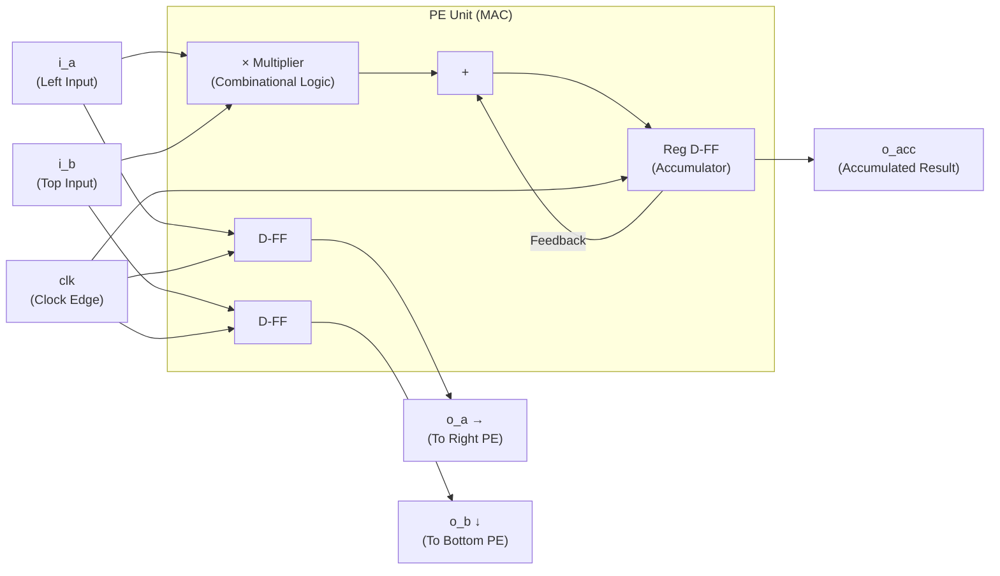
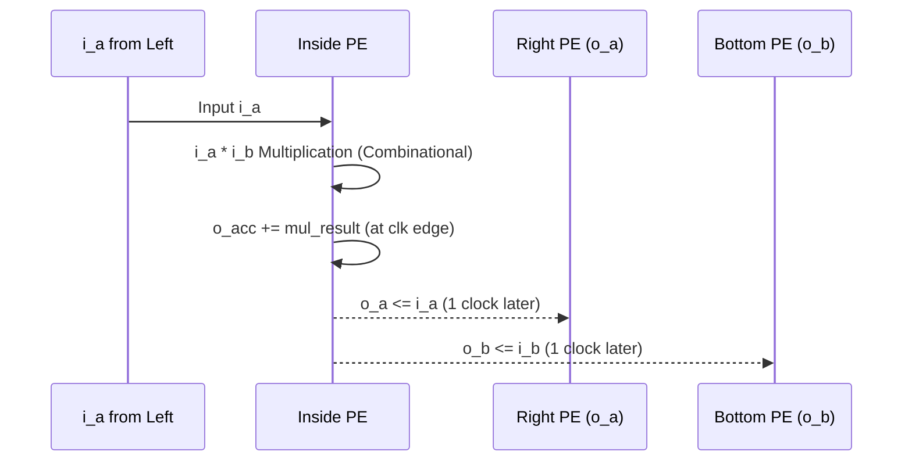

# pe_unit — MAC Computing Engine (Atomic Unit)

## 1. Overview

The PE (Processing Element) is the **Atomic Unit** of the NPU. A single PE has only one job: to multiply two input numbers and continuously accumulate the result. This is known as MAC (Multiply-ACcumulate).

In TinyNPU-Gemma, to perfectly support the **INT8 Quantization Model**, we adopted a **Signed 8-bit multiplier** capable of handling negative numbers, along with a **16-bit (up to 32-bit expandable) accumulator** to prevent overflow.

---

## 2. Internal Structure



### Combinational Logic
The multiplication produces a result **immediately** when inputs change, independent of the clock.
Because Verilog treats numbers as unsigned by default, we must enforce a `$signed()` cast to accurately multiply negative weights and activations. (This was a key issue during early debugging.)

```systemverilog
// Signed 8-bit x Signed 8-bit = Signed 16-bit
assign mul_result = $signed(i_a) * $signed(i_b);
```

### Sequential Logic
The accumulated result is synchronized with the Clock Edge and stored in a register.
```systemverilog
always_ff @(posedge clk or negedge rst_n) begin
    if (!rst_n)
        o_acc <= 16'd0; // Reset Accumulator
    else if (i_valid)
        o_acc <= o_acc + mul_result; // Accumulate signed result every clock
end
```

---

## 3. Data Forwarding Logic

Data flows continuously. The data used by the current PE is forwarded to neighboring PEs **on the next clock cycle**.



**Latency:** There is a **1 Clock Cycle delay** from input to output.

```systemverilog
// Data Pipeline — Forward data to neighboring PEs
o_a <= i_a;  // Pass to Right
o_b <= i_b;  // Pass to Bottom
```

---

## 4. Timing Analysis

```
Clock  ┌─┐ ┌─┐ ┌─┐ ┌─┐ ┌─┐
       ┘ └─┘ └─┘ └─┘ └─┘ └─

i_a    ──┬────X────┬──────
i_b    ──┴────X────┴──────

o_a    ────────►───X────    ← 1 cycle delayed from i_a
o_b    ────────►───X────    ← 1 cycle delayed from i_b
```

---

## 5. Pipeline Control via Valid Signal

If the `i_valid` signal is Low, the operation pauses (Pipeline Stall), and `o_valid` also outputs Low. This valid signal controls the **timing of the wavefront** across the entire Systolic Array.

```systemverilog
always_ff @(posedge clk or negedge rst_n) begin
    if (!rst_n) begin
        o_acc   <= 16'd0;
        o_valid <= 1'b0;
        o_a     <= 8'd0;
        o_b     <= 8'd0;
    end else if (i_valid) begin
        o_acc   <= o_acc + mul_result;  // Accumulate
        o_valid <= 1'b1;
        o_a     <= i_a;                 // Forward right
        o_b     <= i_b;                 // Forward bottom
    end else begin
        o_valid <= 1'b0;                // Stall
    end
end
```

---

## 6. Negative Multiplication Debugging History

In the initial design phase, overlooking Verilog's default behavior, we used standard `*` operators. Consequently, with inputs `i_a = -2` (8'hFE) and `i_b = 3` (8'h03), it produced a completely incorrect (unsigned) result of `254 * 3 = 762`.

**Solution:**
By appending the `signed` keyword to all input port declarations and enforcing the `$signed()` cast for internal operations, the computation ` -2 * 3 = -6` correctly produced a 16-bit 2's complement (`16'hFFFA`), successfully passing hardware verification.

---

## 7. Operational Timing Table (tb_mac_unit Verification Results)

| Cycle | i_a (Signed 8-bit) | i_b (Signed 8-bit) | Multiplication Result (16-bit) | o_acc (Accumulated) |
|-------|---------------------|---------------------|---------------------------------|---------------------|
| reset | 0                   | 0                   | 0                               | **0**               |
| 1     | 2                   | 3                   | 6                               | **6**               |
| 2     | -4                  | 5                   | -20                             | **-14**             |
| 3     | -10                 | -10                 | 100                             | **86** ✓            |

---

## 8. Port Interface

| Port | Direction | Bit Width | Description |
|------|-----------|-----------|-------------|
| `clk` | in | 1 | Clock (100MHz) |
| `rst_n` | in | 1 | Asynchronous Active-Low Reset |
| `i_valid` | in | 1 | Valid Data Signal |
| `i_a` | in | 8 (signed) | Feature Map (A) entering from left |
| `i_b` | in | 8 (signed) | Weight (B) entering from top |
| `o_a` | out | 8 (signed) | Forwarded to right PE |
| `o_b` | out | 8 (signed) | Forwarded to bottom PE |
| `o_valid` | out | 1 | Valid Output Signal |
| `o_acc` | out | 16 (signed)| Accumulated MAC Result |