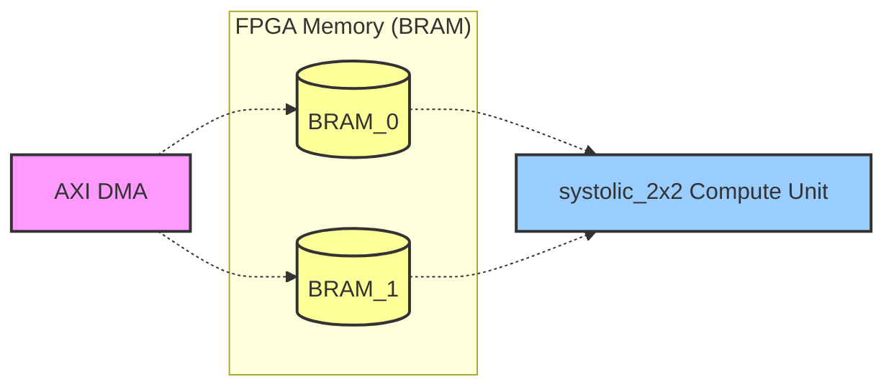
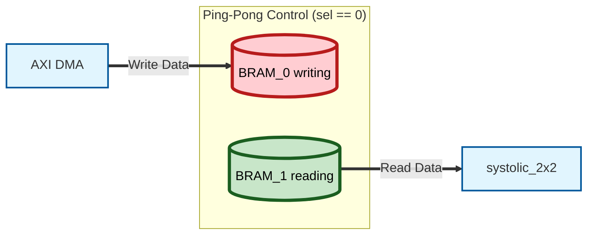
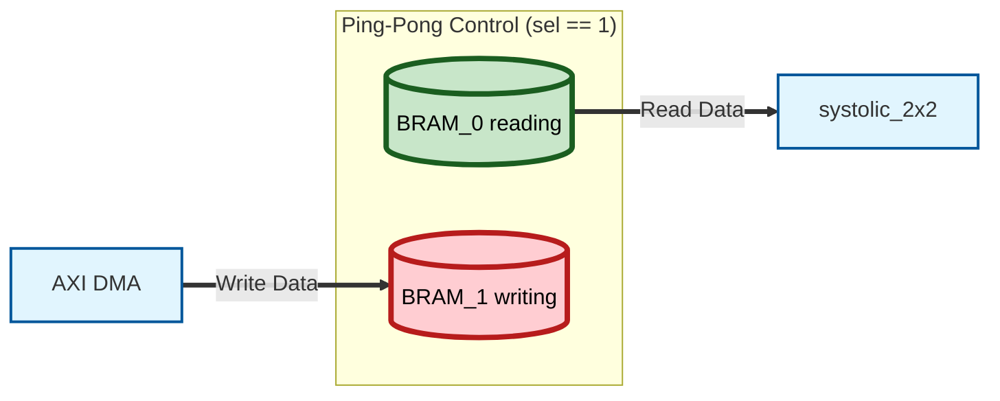

# Ping-Pong BRAM Controller

## 1. Overall Structure (NPU = Mini GPU)
The data flow of the entire system running on the KV260 board is:

> DDR (Main Memory) ↔ BRAM ↔ Systolic Array (Compute Unit)

## 512-bit Data Packing
To push the memory bandwidth to its absolute limit, we expanded the width of a single BRAM slot to 512 bits. With a single Read request, we fetch both the A and B data required for matrix multiplication simultaneously.

* **Upper 256-bit:** Stores Weights (B) data (8-bit x 32 values)
* **Lower 256-bit:** Stores Activations (A) data (8-bit x 32 values)

Translating this to a CUDA environment:

> Host RAM ↔ Shared Memory ↔ CUDA Cores

We are designing the deepest (Core) hardware part: fetching data from Shared Memory, computing it in CUDA Cores, and storing it back.

---

## 1. AXI DMA (Direct Memory Access)

CUDA Analogy: `cudaMemcpy(d_A, h_A, size, cudaMemcpyHostToDevice)`

It is too slow if the CPU (ARM core) moves data one by one.
Instead, we issue a command to push the array data from main memory (DDR) to the NPU, and this hardware block automatically streams the data at high speed.

## 2. BRAM (Block RAM)

CUDA Analogy: Shared Memory (`__shared__`) or L1 Cache

A small, incredibly fast chunk of SRAM embedded inside the FPGA chip. Once the DMA temporarily stores the data fetched from DDR here, the `systolic_2x2` consumes this data every clock cycle. We use two BRAMs as a ping-pong buffer.

## 3. Parameter

C++ Analogy: `template <int N>` or `#define SIZE 8`

```verilog
    parameter DATA_WIDTH = 8,
    parameter ADDR_WIDTH = 8 // 256 depth
```
These are constants that determine the hardware size or specifications before the code is synthesized into a chip. For instance, declaring `parameter DATA_WIDTH = 8` tells the compiler, "Ah, this module uses 8-bit wires," and it draws the circuit accordingly.

## 4. Address Computation

C++ Analogy: Array index `array[index]`

A number specifying which slot in memory to read from or write to. While software uses pointers or indices, hardware operates by sending an electrical signal like `00000001` over an 8-bit `addr` wire to "open the door" to index 1 of the memory.

## 5. MUX (Multiplexer)

C++ Analogy: `if-else` statement, ternary operator `? :`, or pointer switching

```verilog
    // BRAM 0 Control
    assign we_0   = (ping_pong_sel == 1'b0) ? dma_we   : 1'b0;       // Prohibit Write when NPU is using it
    assign addr_0 = (ping_pong_sel == 1'b0) ? dma_addr : sys_addr;

    // BRAM 1 Control
    assign we_1   = (ping_pong_sel == 1'b1) ? dma_we   : 1'b0;       // Prohibit Write when NPU is using it
    assign addr_1 = (ping_pong_sel == 1'b1) ? dma_addr : sys_addr;

    // Data going out to the Systolic Array (Demux)
    assign sys_rdata = (ping_pong_sel == 1'b0) ? rdata_1 : rdata_0;
```
In software, if an `if` condition is false, the code inside is completely ignored. However, in hardware, all modules (wires) are constantly active with electricity flowing. Therefore, we attach a physical switch called a MUX to create a path: "If the select signal is 0, pass the data from wire A; if 1, pass wire B!" The code `assign sys_rdata = (sel == 0) ? rdata_1 : rdata_0;` is exactly this MUX circuit.

---

## Ping-Pong Mechanism

### 1. Create two internal modules: BRAM_0 and BRAM_1.


### 2. Introduce a 1-bit switch (pointer) called `ping_pong_sel`.

### 3. When `ping_pong_sel == 0`:
The AXI DMA (external memory) diligently writes the next data block to `BRAM_0`, while simultaneously, our compute unit reads the already-prepared data from `BRAM_1` and executes the calculation.

* **Scenario 1:** `ping_pong_sel == 0`
Switch State: Input goes top (0), output comes from bottom (1).
DMA: Actively fills `BRAM_0` with data (Write).
Systolic: Fetches data from the already-filled `BRAM_1` and computes (Read).



* **Switching:** After both sides finish their tasks
If the DMA has finished writing and the Systolic Array has finished computing, the switch flips:
`ping_pong_sel = ~ping_pong_sel` (0 → 1).

* **Scenario 2:** `ping_pong_sel == 1`
Switch State: The paths cross.
DMA: Now fills the empty `BRAM_1` with new data.
Systolic: Fetches data from `BRAM_0` (which the DMA just filled in Scenario 1) and computes.



### 4. When tasks are complete, switch! `ping_pong_sel = ~ping_pong_sel;`

```c++
int buffer_0[256]; // BRAM 0
int buffer_1[256]; // BRAM 1

// Phase 1 (ping_pong_sel = 0)
buffer_0[0] = 10; // 0a
buffer_0[1] = 20; // 14

// Phase 2 (ping_pong_sel = 1)
// The NPU safely reads data from buffer_0
int read_val = buffer_0[0]; 

// Simultaneously, the DMA writes the next data into buffer_1!
buffer_1[0] = 30; // 1e  <-- 30 goes in here!
```

---

## 5. BRAM Latency and Preload State (Debugging History)

> **Q:** "On the simulation waveform, the moment `dma_addr` and `wdata` of `00`, `0a`(10) enter the RAM, it looks like `01`, `14`(20) are assigned to `dma_addr` and `wdata` at the exact same clock cycle. Is this okay?"

**A:** The core principle of hardware: **"Read the past, write the future"** (<= Non-blocking)

**Debugging History: Resolving the 1-Cycle Delay Issue**
In the initial design, we tried to inject the BRAM address and immediately read data the moment the FSM entered the `Run` state. However, **because BRAM is synchronous memory, the data is output exactly 1 clock cycle after the address is provided (Read Latency).**
This caused a bug where garbage data entered the array on the very first clock cycle.

**Solution:**
We inserted an intermediate state called `PRELOAD` into the FSM.
1. `PRELOAD`: Inject address `0` into the BRAM and wait for 1 clock cycle.
2. `RUN`: After 1 clock cycle, the real data for address `0` starts coming out, so we turn on the NPU valid signal and begin computing.

All flip-flops (memory, registers) in hardware only operate on the **Rising Edge** (the moment the waveform shoots up from 0 to 1). There are two absolute rules here:

* **Setup Time:** When reading, you read the value from "just before the clock jumped (the past)."
* **Clock-to-Q:** Changes only take effect "right after the clock jumped (the future)."

[0.001 seconds before the clock jumps]
* `dma_addr` is holding `00`, and `dma_wdata` is holding `0a` (10).

[Clock Edge Occurs]
* **BRAM:** Takes the address (`00`) and data (`0a`) it *just* had and stores it (so `10` is stored in `ram[0]`).
* **Testbench (DMA):** Assigns the new address `01` and data `14` (20) (the waveform values change here).

```c++
// What happens every clock cycle (Loop)
int old_addr = current_addr;
int old_data = current_data;

// 1. The BRAM reads the old (past) values and stores them
ram[old_addr] = old_data; 

// 2. The testbench updates to new values (happens simultaneously!)
current_addr = 1;
current_data = 20;
```