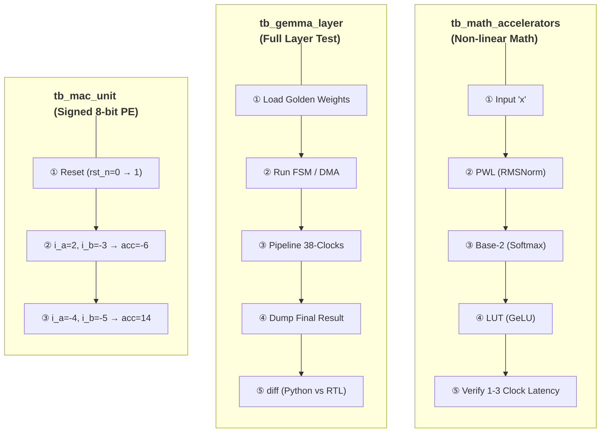

# Testbench & Verification: Bit-True to Python

To verify the functionality and timing of the TinyNPU-Gemma core, a top-down integrated simulation approach is employed. Our ultimate goal is **0% Error (Bit-True Match)** against the Python (NumPy/PyTorch) Golden Model.

## Trace-Driven Verification

Rather than simple random data testing, we adopted a **Trace-Driven Verification** method, which extracts a **Golden Trace** directly from Python (PyTorch/NumPy) and injects it into the Verilog simulation to compare results.

## Debugging History: Python vs Verilog Bit-True Matching

We meticulously compared the Python memory hex dumps with the captured output port values of the NPU at every intermediate computation stage.

1. **MAC Result Verification:** When the MAC Array output `24`, we ensured the Python array value at the exact same coordinate was also `24`.
2. **GeLU Pass Verification:** When the NPU fed the MAC value `24` through the GeLU module and output `12`, we confirmed the Python Golden model's GeLU output was exactly `12`.
3. **Achieving 0% Error Rate:** We successfully proved that all INT8 quantization-based `+`, `*`, Shift, and Custom LUT operations run completely identically to the S/W results in hardware.

---

## Overall Verification Structure (`tb_gemma_layer.sv` & `tb_npu_core_top_NxN.sv`)

---

## Verification Environment

**EDA Tool:** Xilinx Vivado 2025.2  
**Target:** Xilinx Kria KV260 Vision AI Starter Kit
**Simulator:** XSim (Built into Vivado)
